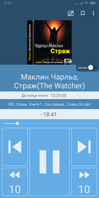

Snail Audiobook Player
=========

Приложение для прослушивания аудиокниг и лекций

Google Play: https://play.google.com/store/apps/details?id=com.a44dw.audiobookplayer

Функции:

- Файловый менеджер
- Закладки
- Скорость воспроизведения (для Android Marshmallow и выше)
- Настраиваемые кнопки перемотки

-------------

- Построено полностью на фрагментах по принципу single-activity
- Использовал android architecture components: ViewModel, LiveData, Room

Выполнено в ноябре 2018
